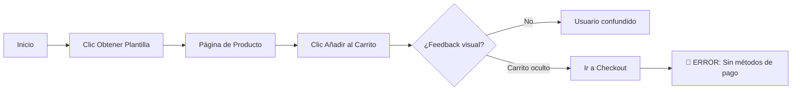

# Documentación Sitio Web Nuevo - CSalcedoDataBI

> **Fecha de Auditoría:** 26 de Diciembre, 2025  
> **URL del Sitio:** http://localhost:8080  
> **Evaluador:** Antigravity AI  

---

## Resumen Ejecutivo

El sitio web CSalcedoDataBI presenta una base tecnológica **sólida y un diseño moderno premium** con tema oscuro y acentos en azul neón. Sin embargo, se identificaron **falencias críticas** que impiden completar ventas y afectan la experiencia de usuario.

### Calificación General

| Aspecto | Puntuación | Estado |
|---------|------------|--------|
| Diseño Visual | 9/10 | ✅ Excelente |
| Navegación | 8/10 | ✅ Bueno |
| Responsividad | 7/10 | ⚠️ Requiere ajustes |
| Flujo de Compra | 3/10 | 🔴 Crítico |
| Escalabilidad | 6/10 | ⚠️ Por validar |

---

## 1. Exploración Inicial - Primera Impresión

### Lo que funciona bien ✅

- **Diseño Premium Dark Mode:** El tema oscuro con gradientes y efectos glassmorphism transmite profesionalismo
- **Hero Section Impactante:** Título "Domina el Arte del Data Storytelling" claro y persuasivo
- **CTAs Visibles:** Botones "Ver Plantillas Premium" y "Explorar Blog" bien posicionados
- **Branding Consistente:** Logo animado y tagline "INSIGHTS BY DENEB" coherentes

### Capturas de Pantalla

````carousel

<!-- slide -->

````

---

## 2. Flujo de Compra - Análisis Crítico

### Proceso Evaluado
`Inicio → Clic "Obtener Plantilla" → Página Producto → Añadir al Carrito → Checkout`

### Problemas Identificados

> [!CAUTION]
> **BLOQUEO TOTAL DE VENTAS:** El checkout muestra "No hay métodos de pago disponibles". Es IMPOSIBLE completar una compra.

| # | Problema | Severidad | Impacto |
|---|----------|-----------|---------|
| 1 | No hay métodos de pago configurados | 🔴 Crítico | Bloquea 100% de ventas |
| 2 | Sin feedback visual al añadir al carrito | 🟡 Medio | Confusión del usuario |
| 3 | Botón "Obtener Plantilla" redirige en vez de añadir | 🟡 Medio | Fricción innecesaria |

### Detalle del Flujo



---

## 3. Navegación y Rendimiento

### Menú de Navegación
- **Opciones:** INICIO | PLANTILLAS | TIPS POWER BI | SOBRE MÍ | CONTACTO
- **Funcionalidad:** ✅ Todos los enlaces funcionan correctamente

### Tiempos de Carga
| Página | Tiempo | Evaluación |
|--------|--------|------------|
| Inicio | < 1s | ✅ Excelente |
| Plantillas | < 1s | ✅ Excelente |
| Blog | < 1s | ✅ Excelente |
| Sobre Mí | < 1s | ✅ Excelente |
| Contacto | < 1s | ✅ Excelente |

### Capturas de Secciones

````carousel

<!-- slide -->

<!-- slide -->

````

---

## 4. Facilidad de Contacto

### Métodos Disponibles
| Método | Disponible | Ubicación |
|--------|------------|-----------|
| Formulario de contacto | ✅ Sí | Página /contacto/ |
| Email directo | ✅ Sí | contacto@csalcedodatabi.com |
| LinkedIn | ✅ Sí | Footer |
| GitHub | ✅ Sí | Footer |
| YouTube | ✅ Sí | Footer |
| WhatsApp | ❌ No | - |
| Chat en vivo | ❌ No | - |

> [!TIP]
> Considerar añadir WhatsApp Business para comunicación inmediata con clientes potenciales.

---

## 5. Responsividad (Mobile/Tablet)

### Pruebas Realizadas

| Dispositivo | Ancho | Productos/Fila | Estado |
|-------------|-------|----------------|--------|
| Desktop | >1024px | 3 | ✅ Correcto |
| Tablet | 768px | 2 | ✅ Correcto |
| Móvil | 375px | 1 | ✅ Correcto |

### Capturas Mobile

````carousel

<!-- slide -->

````

### Problemas de Responsividad

> [!WARNING]
> **Menú Hamburguesa:** Durante las pruebas, el menú móvil no desplegó consistentemente. Posible problema de z-index o JavaScript.

| # | Problema | Severidad |
|---|----------|-----------|
| 4 | Menú hamburguesa inconsistente | 🟡 Medio |
| 5 | Carrito "stealth" puede confundir usuarios | 🟢 Bajo |

---

## 6. Escalabilidad de Contenido

### Estado Actual
- **Productos:** 3 plantillas
- **Entradas Blog:** 1 artículo

### Evaluación de Grid

El sistema de grid actual usa CSS Flexbox/Grid responsive:
- ✅ Desktop: 3 productos por fila
- ✅ Tablet: 2 productos por fila  
- ✅ Móvil: 1 producto por fila

### Consideraciones para Escalar

| Escenario | Impacto | Recomendación |
|-----------|---------|---------------|
| 9 productos | Grid funcionará | Implementar paginación |
| 20 productos | Página muy larga | Paginación obligatoria |
| 10 blogs | Lista vertical muy larga | Cambiar a grid 3 columnas |

> [!IMPORTANT]
> Actualmente **NO hay paginación** en tienda ni blog. Crítico implementar antes de escalar.

---

## 7. Inventario Completo de Falencias

### Prioridad Crítica 🔴

| ID | Problema | Página | Solución Propuesta |
|----|----------|--------|-------------------|
| F01 | Sin métodos de pago | Checkout | Configurar Stripe/PayPal en WooCommerce |
| F02 | Sin notificación "Añadido al carrito" | Global | Implementar toast notifications |

### Prioridad Media 🟡

| ID | Problema | Página | Solución Propuesta |
|----|----------|--------|-------------------|
| F03 | Menú hamburguesa inconsistente | Mobile | Revisar JavaScript del tema |
| F04 | Botón redirige en vez de añadir | Inicio | Cambiar comportamiento AJAX |
| F05 | Sin paginación en tienda | Plantillas | Configurar WooCommerce |
| F06 | Sin paginación en blog | Blog | Configurar WordPress |
| F07 | Blog usa lista vertical | Blog | Cambiar a grid 3 columnas |

### Prioridad Baja 🟢

| ID | Problema | Página | Solución Propuesta |
|----|----------|--------|-------------------|
| F08 | Carrito invisible cuando vacío | Header | Mostrar icono siempre |
| F09 | Sin WhatsApp/Chat | Global | Añadir widget flotante |
| F10 | Sin breadcrumbs | Productos | Añadir navegación jerárquica |

---

## 8. Plan de Trabajo Propuesto

### Sprint 1: Crítico (Inmediato)

```
[x] 0. Rediseño Checkout World-Class (2 Columnas + Sticky Sidebar)
    └── Completado: 29/12/2025
    └── Diseño premium V3, layout corregido, layout 2 columnas forzado. Verificado en Móvil/Desktop.

[ ] 1. Configurar métodos de pago (Stripe + PayPal)
    └── Prioridad: MÁXIMA - Bloquea todas las ventas
    └── Tiempo estimado: 2-4 horas
    
[ ] 2. Implementar notificaciones al carrito
    └── Prioridad: Alta - Mejora UX significativamente  
    └── Tiempo estimado: 1-2 horas
```

### Sprint 2: UX Mobile (Siguiente)

```
[ ] 3. Corregir menú hamburguesa en móvil
    └── Revisar scripts y z-index
    └── Tiempo estimado: 1-2 horas
    
[ ] 4. Mejorar visibilidad del carrito
    └── Mostrar icono siempre, badge con cantidad
    └── Tiempo estimado: 30 min
```

### Sprint 3: Escalabilidad (Posterior)

```
[ ] 5. Implementar paginación en tienda
    └── WooCommerce Settings o plugin
    └── Tiempo estimado: 1 hora
    
[ ] 6. Rediseñar layout del blog
    └── Grid de 3 columnas + paginación
    └── Tiempo estimado: 2-3 horas
    
[ ] 7. Añadir productos de prueba (6-9)
    └── Validar comportamiento del grid
    └── Tiempo estimado: 1 hora
```

### Sprint 4: Mejoras Opcionales

```
[ ] 8. Añadir WhatsApp Business widget
[ ] 9. Implementar breadcrumbs
[ ] 10. Añadir más entradas de blog para testing
```

---

## Grabaciones de las Pruebas

Las siguientes grabaciones documentan el proceso de auditoría:

| Prueba | Grabación |
|--------|-----------|
| Exploración Inicial | [home_exploration.webp](file:///C:/Users/Cristobal/.gemini/antigravity/brain/d22821b3-3f77-4645-9aa1-017ecfff34b3/home_exploration_1766771861386.webp) |
| Flujo de Compra | [purchase_flow_test.webp](file:///C:/Users/Cristobal/.gemini/antigravity/brain/d22821b3-3f77-4645-9aa1-017ecfff34b3/purchase_flow_test_1766771964483.webp) |
| Responsividad | [mobile_responsive_test.webp](file:///C:/Users/Cristobal/.gemini/antigravity/brain/d22821b3-3f77-4645-9aa1-017ecfff34b3/mobile_responsive_test_1766772140999.webp) |
| Navegación | [blog_navigation_test.webp](file:///C:/Users/Cristobal/.gemini/antigravity/brain/d22821b3-3f77-4645-9aa1-017ecfff34b3/blog_navigation_test_1766772319136.webp) |

---

## Conclusión

El sitio CSalcedoDataBI tiene un **excelente potencial** con un diseño premium y profesional. Sin embargo, el **bloqueo crítico en el checkout** impide monetizar. 

**Recomendación inmediata:** Configurar métodos de pago antes de cualquier otra mejora.

Una vez resuelto el checkout, el sitio estará listo para recibir clientes. Las mejoras de UX (notificaciones, menú móvil) y escalabilidad (paginación) pueden implementarse progresivamente.
